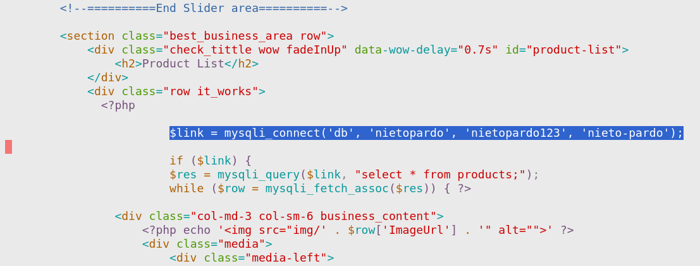

# a07u - Desplegant una aplicació web PHP amb Docker Compose, Nginx i MariaDB

Els grups han quedat de la següent manera:

### Taula dels grups

<table>
  <tr>
    <th rowspan="3">Id</th>
    <th rowspan="3">Alumne/a</th>
    <th rowspan="3">Grup</th>
    <th colspan="3"><b>Informació de la base de dades</b></th>
  </tr>
  <tr>
    <th rowspan="2">Nom de la base de dades</th>
    <th rowspan="2">Usuari de connexió a la base de dades</th>
    <th rowspan="2">Contrasenya de l'usuari de connexió</th>
  </tr>
  <tr></tr>
  <tr>
    <td>7312</td><td>Agustí Corbella, Oriol</td><td rowspan="2">Grup&nbsp;01</td><td rowspan="2">agusti-roman</td><td rowspan="2">agustiroman</td><td rowspan="2">agustiroman123</td>
  </tr>
  <tr>
  <td>7422</td><td>Román Robles, Àlex</td>
</tr>
<tr><td>7674</td><td>Boada Cirera, Jan</td><td rowspan="2">Grup&nbsp;02</td><td rowspan="2">boada-cot</td><td rowspan="2">boadacot</td><td rowspan="2">boadacot123</td></tr>
<tr><td>7596</td><td>Cot Fontanella, Marc</td></tr>
<tr><td>7582</td><td>Bollero Ruzafa, Ivan</td><td rowspan="2">Grup&nbsp;03</td><td rowspan="2">bollero-pan</td><td rowspan="2">bolleropan</td><td rowspan="2">bolleropan123</td></tr>
<tr><td>7683</td><td>Pan , Jiahao</td></tr>
<tr><td>7572</td><td>Capel Vallbona, Marc</td><td rowspan="2">Grup&nbsp;04</td><td rowspan="2">capel-codina</td><td rowspan="2">capelcodina</td><td rowspan="2">capelcodina123</td></tr>
<tr><td>7604</td><td>Codina Garcia, Aleix</td></tr>
<tr><td>2708</td><td>Casas Lopez, Raul</td><td rowspan="2">Grup&nbsp;05</td><td rowspan="2">casas-sardana</td><td rowspan="2">casassardana</td><td rowspan="2">casassardana123</td></tr>
<tr><td>7653</td><td>Sardaña Trinh, Marc</td></tr>
<tr><td>7579</td><td>Córdoba Xandri, Oriol</td><td rowspan="2">Grup&nbsp;06</td><td rowspan="2">cordoba-puriy</td><td rowspan="2">cordobapuriy</td><td rowspan="2">cordobapuriy123</td></tr>
<tr><td>7659</td><td>Puriy Puriy, Nicolas</td></tr>
<tr><td>7636</td><td>Deus Jurado, Izan</td><td rowspan="2">Grup&nbsp;07</td><td rowspan="2">deus-ortiz</td><td rowspan="2">deusortiz</td><td rowspan="2">deusortiz123</td></tr>
<tr><td>7576</td><td>Ortiz Guerrero, Antoni</td></tr>
<tr><td>7627</td><td>Gálvez Comajuan, Marc</td><td rowspan="2">Grup&nbsp;08</td><td rowspan="2">galvez-sohl</td><td rowspan="2">galvezsohl</td><td rowspan="2">galvezsohl123</td></tr>
<tr><td>7710</td><td>Sohl Brenes, Martin Albert</td></tr>
<tr><td>7598</td><td>Garcia Fernández, Adrià</td><td rowspan="2">Grup&nbsp;09</td><td rowspan="2">garcia-morales</td><td rowspan="2">garciamorales</td><td rowspan="2">garciamorales123</td></tr>
<tr><td>7473</td><td>Morales Gonzalez, Jan</td></tr>
<tr><td>7673</td><td>Garcia Romero, Arnau</td><td rowspan="2">Grup&nbsp;10</td><td rowspan="2">garcia-royuela</td><td rowspan="2">garciaroyuela</td><td rowspan="2">garciaroyuela123</td></tr>
<tr><td>7799</td><td>Royuela Martín, Oriol</td></tr>
<tr><td>7500</td><td>Lamela Garcia, Alvaro Haoan</td><td rowspan="2">Grup&nbsp;11</td><td rowspan="2">lamela-soler</td><td rowspan="2">lamelasoler</td><td rowspan="2">lamelasoler123</td></tr>
<tr><td>7614</td><td>Soler Sampere, Arnau</td></tr>
<tr><td>7532</td><td>Martinez Segú, Eric</td><td rowspan="2">Grup&nbsp;12</td><td rowspan="2">martinez-moreno</td><td rowspan="2">martinezmoreno</td><td rowspan="2">martinezmoreno123</td></tr>
<tr><td>7684</td><td>Moreno Fernández, Nil</td></tr>
<tr><td>7672</td><td>Pan , Le</td><td rowspan="2">Grup&nbsp;13</td><td rowspan="2">pan-sacristan</td><td rowspan="2">pansacristan</td><td rowspan="2">pansacristan123</td></tr>
<tr><td>7836</td><td>Sacristan Castillo, Marc</td></tr>
<tr><td>7581</td><td>Putellas Martín, Pol</td><td rowspan="2">Grup&nbsp;14</td><td rowspan="2">putellas-vazquez</td><td rowspan="2">putellasvazquez</td><td rowspan="2">putellasvazquez123</td></tr>
<tr><td>7632</td><td>Vázquez Pelàez, Alex</td></tr>
<tr><td>7260</td><td>Navarro Galan, Gerard</td><td rowspan="3">Grup&nbsp;15</td><td rowspan="3">navarro-rueda-selles</td><td rowspan="3">navarroruedaselles</td><td rowspan="3">navarroruedaselles123</td></tr>
<tr><td>7668</td><td>Rueda Guàrdia, Marc</td></tr>
<tr><td>7459</td><td>Sellés Puyol, Aniol</td></tr>

</table>

## Pas 1: Comprovació de que tenim descarregades les imatges.

* **Comanda a executar**:

```bash
sudo docker image list |grep php
sudo docker image list |grep nginx
sudo docker image list |grep mariadb
```

> Si no apareixen les imatges, llavors cal que les descarreguem:
>
> ```bash
> sudo docker pull php:7.0-fpm
> sudo docker pull nginx
> sudo docker pull mariadb
> ```

## Pas 2: Creació de la carpeta per ubicar el nostre sistema de contenidors.

El nom de la carpeta a on cal que ubiquem el nostre sistema de contenidors serà **```<CognomAlumne1>-<CognomAlumne2>```**.

On:
* **```<CognomAlumne1>```** és el **primer dels cognom** del **primer alumne** i
* **```<CognomAlumne2>```** és el **primer dels cognom** del **segon alumne**.

Com a ***primer*** i ***segon*** alumne s'enten l'ordre que queda una cop que els cognoms dels alumnes s'han ordenat alfabèticament.

Per exemple, en el cas de que els cognoms dels alumnes fossin, **Joan Pardo** i **Iván Nieto**, el nom de la carpeta seria **```nieto-pardo```**, ja que **Nieto** està en primera posició si ordenem els cognoms alfabeticament.

* **Comanda a executar**:

```bash
sudo mkdir ~/<CognomAlumne1>-<CognomAlumne2>
cd ~/<CognomAlumne1>-<CognomAlumne2>
```

* **Sortida**:

<pre>
sudo mkdir ~/nieto-pardo
cd ~/nieto-pardo
</pre>

## Pas 3: Creació de la carpeta per ubicar la configuració i els fitxers pel contenidor ```web``` del nostre sistema de contenidors.

* **Comanda a executar**:

```bash
sudo mkdir ~/<CognomAlumne1>-<CognomAlumne2>/webSrv
```

* **Sortida**:

<pre>
sudo mkdir ~/nieto-pardo/webSrv
</pre>

## Pas 4: Creació del fitxer ```Dockerfile``` per la creació del contenidor ```web``` del nostre sistema de contenidors.

* **Comanda a executar**:

```bash
sudo vi ~/<CognomAlumne1>-<CognomAlumne2>/webSrv/Dockerfile
```

* **Sortida**:

<pre>
sudo vi ~/nieto-pardo/webSrv/Dockerfile
</pre>

I el contingut del fitxer **```~/<CognomAlumne1>-<CognomAlumne2>/webSrv/Dockerfile```** és el següent:

```yml
FROM nginx
COPY ./default.conf /etc/nginx/conf.d/default.conf
```

## Pas 5: Creació del fitxer de configuració del fitxer ```default.conf``` per la configuració del contenidor ```web``` del nostre sistema de contenidors.

* **Comanda a executar**:

```bash
sudo vi ~/<CognomAlumne1>-<CognomAlumne2>/webSrv/default.conf
```

* **Sortida**:

<pre>
sudo vi ~/nieto-pardo/webSrv/default.conf
</pre>

I el contingut del fitxer **```~/<CognomAlumne1>-<CognomAlumne2>/webSrv/default.conf```** és el següent:

```
server {  

     listen 80 default_server;  
     root /var/www/html;  
     index index.html index.php;  

     charset utf-8;  

     location / {  
      try_files $uri $uri/ /index.php?$query_string;  
     }  

     location = /favicon.ico { access_log off; log_not_found off; }  
     location = /robots.txt { access_log off; log_not_found off; }  

     access_log off;  
     error_log /var/log/nginx/error.log error;  

     sendfile off;  

     client_max_body_size 100m;  

     location ~ .php$ {  
      fastcgi_split_path_info ^(.+.php)(/.+)$;  
      fastcgi_pass php:9000;  
      fastcgi_index index.php;  
      include fastcgi_params;
      fastcgi_read_timeout 300;
      fastcgi_param SCRIPT_FILENAME $document_root$fastcgi_script_name;  
      fastcgi_intercept_errors off;  
      fastcgi_buffer_size 16k;  
      fastcgi_buffers 4 16k;  
    }  

     location ~ /.ht {  
      deny all;  
     }  
    }	
```

## Pas 6: Descarrega d'una pàgina ja existent, escrita en ```php```, per mostrar informació.

* **Comanda a executar**:

```bash
sudo git clone https://github.com/rapidcode-technologies-private-limited/php-e-commerce.git ~/<CognomAlumne1>-<CognomAlumne2>/phpSrv/
```

## Pas 7: Creació del fitxer ***```Dockerfile```*** per la configuració del contenidor ```php``` del nostre sistema de contenidors.

* **Comanda a executar**:

```
sudo vi ~/<CognomAlumne1>-<CognomAlumne2>/phpSrv/Dockerfile
```

El contingut del fitxer **```~/<CognomAlumne1>-<CognomAlumne2>/phpSrv/Dockerfile```** és el següent:

```bash
FROM php:7.0-fpm
RUN docker-php-ext-install mysqli pdo pdo_mysql
RUN docker-php-ext-enable mysqli
```

## Pas 8: Creació del fitxer ***```docker-compose.yml```*** per la configuració del nostre sistema de contenidors.

* **Comanda a executar**:

```bash
sudo vi ~/<CognomAlumne1>-<CognomAlumne2>/docker-compose.yml
```

El contingut del fitxer **```~/<CognomAlumne1>-<CognomAlumne2>/docker-compose.yml```** és el següent:

```yml
version: "3.9"
services:
   nginx:
     build: ./webSrv/
     ports:
       - 80:80
  
     volumes:
         - ./phpSrv/:/var/www/html/

   php:
     build: ./phpSrv/
     expose:
       - 9000
     volumes:
        - ./phpSrv/:/var/www/html/


   db:    
      image: mariadb  
      volumes: 
        -    mysql-data:/var/lib/mysql
      environment:  
       MYSQL_ROOT_PASSWORD: mariadb
       MYSQL_DATABASE: <nom de la vostra base de dades> 


volumes:
    mysql-data:
```

> [!WARNING]
> ## Si us dona un error, fixeu-vos que a la variable de sistema **```MYSQL_DATABASE```** cal que en comptes de la cadena de lletres **```<nom de la vostra base de dades>```**, hi poseu en nom de la vostra base de dades, que us hem facilitat a la [taula dels grups](#taula-dels-grups) que apareix a l'inici.

## Pas 9: Arrencar el nostre sistema de contenidors

* **Comanda a executar**:

```bash
cd ~/<CognomAlumne1>-<CognomAlumne2>/
sudo docker compose up -d
```

* **Sortida**:

<pre>
joan@ubuntudocker2:~/nieto-pardo$ sudo docker compose up -d
[+] Building 0.2s (14/14) FINISHED                                     docker:default
 => [nginx internal] load build definition from Dockerfile                       0.0s
 => => transferring dockerfile: 99B                                              0.0s
 => [nginx internal] load .dockerignore                                          0.0s
 => => transferring context: 2B                                                  0.0s
 => [php internal] load build definition from Dockerfile                         0.0s
 => => transferring dockerfile: 135B                                             0.0s
 => [php internal] load .dockerignore                                            0.0s
 => => transferring context: 2B                                                  0.0s
 => [nginx internal] load metadata for docker.io/library/nginx:latest            0.0s
 => [php internal] load metadata for docker.io/library/php:7.0-fpm               0.0s
 => [nginx internal] load build context                                          0.0s
 => => transferring context: 972B                                                0.0s
 => [nginx 1/2] FROM docker.io/library/nginx                                     0.1s
 => [php 1/3] FROM docker.io/library/php:7.0-fpm                                 0.0s
 => CACHED [php 2/3] RUN docker-php-ext-install mysqli pdo pdo_mysql             0.0s
 => CACHED [php 3/3] RUN docker-php-ext-enable mysqli                            0.0s
 => [php] exporting to image                                                     0.0s
 => => exporting layers                                                          0.0s
 => => writing image sha256:e7545954a71357238a8d8fef56bdeaf5ccf1aad8cb028d9e067  0.0s
 => => naming to docker.io/library/nieto-pardo-php                               0.0s
 => [nginx 2/2] COPY ./default.conf /etc/nginx/conf.d/default.conf               0.0s
 => [nginx] exporting to image                                                   0.0s
 => => exporting layers                                                          0.0s
 => => writing image sha256:61abb3aef46f2dc9097f3c7bf846a6a2a77366ea0768ea404b0  0.0s
 => => naming to docker.io/library/nieto-pardo-nginx                             0.0s
[+] Running 4/4
 ✔ Network nieto-pardo_default    Created                                        0.1s 
 ✔ Container nieto-pardo-db-1     Started                                        0.0s 
 ✔ Container nieto-pardo-nginx-1  Started                                        0.0s 
 ✔ Container nieto-pardo-php-1    Started                                        0.0s 
joan@ubuntudocker2:~/nieto-pardo$ 
</pre>


## Pas 10: Configurar el contenidor de base de dades

Per aquest pas cal que fem tot un seguit de passos intermitjos:

### Pas 10.1: Obtenir el nom del contenidor de base de dades

Per obtenir quin és el **nom del contenidor de base de dades**, podem llistar tots els contenidors i filtrar per un tros del nom del contenidor.

* **Comanda a executar**:

```bash
sudo docker container list -a | grep db-1
```

* **Sortida**:

<pre>
joan@ubuntudocker2:~/nieto-pardo$ sudo docker container list -a | grep db-1
fa875dd53f85   mariadb             "docker-entrypoint.s…"   33 seconds ago   Up 32 seconds   3306/tcp                            nieto-pardo-db-1
joan@ubuntudocker2:~/nieto-pardo$ 
</pre>

En el nostre cas el nom del contenidor és **```nieto-pardo-db-1```**.

### Pas 10.2: Connectar-nos al contenidor de base de dades

Ara que ja tenim el nom del contenidor al qua ens volem connectar, cal executar la següent comanda:

```bash
sudo docker exec -ti <CognomAlumne1>-<CognomAlumne2>-db-1 bash
```

* **Sortida**:

<pre>
joan@ubuntudocker2:~/nieto-pardo$ sudo docker exec -ti nieto-pardo-db-1 bash
root@fa875dd53f85:/# 
</pre>

Veiem que estem connectats amb l'usuari **```root```** al contenidor amb el nom **```fa875dd53f85```**. Aquest nom del servidor és el nom del identificador del contenidor.

### Pas 10.3: Entrar al gestor de base de dades **```mariadb```**.

Un cop que ja estem dins del servidor accedim al gestor de base de dades **```mariadb```**.

* **Comanda a executar**:

```bash
mariadb -u root -pmariadb
```

* **Sortida**:

<pre>
root@fa875dd53f85:/# mariadb -u root -pmariadb
Welcome to the MariaDB monitor.  Commands end with ; or \g.
Your MariaDB connection id is 3
Server version: 11.2.2-MariaDB-1:11.2.2+maria~ubu2204 mariadb.org binary distribution

Copyright (c) 2000, 2018, Oracle, MariaDB Corporation Ab and others.

Type 'help;' or '\h' for help. Type '\c' to clear the current input statement.

MariaDB [(none)]> 
</pre>

### Pas 10.4: Creació de l'usuari i la contrasenya per connectar-nos a la base de dades.

El nom de l'usuari per connectar-nos a la base de dades, el trovareu a la taula que us hem facilitat a la [taula dels grups](#taula-dels-grups) que apareix a l'inici, és el de la columna **```Usuari de connexió a la base de dades```**, mentre que la contrasenya és la que apareix a la columna **```Contrasenya de l'usuari de connexió```** de la mateixa taula.

* **Comanda a executar**:

```sql
CREATE USER '<usuari de connexió a la base de dades>'@'%' IDENTIFIED BY "<usuari de connexió a la base de dades>123";
```

* **Sortida**:

<pre>
MariaDB [(none)]> CREATE USER 'nietopardo'@'%' IDENTIFIED BY "nietopardo123";
Query OK, 0 rows affected (0.005 sec)

MariaDB [(none)]> 
</pre>

Per validar que l'usuari ha estat creat correctament podeu executar la següent comanda:

* **Comanda a executar**:

```sql
SELECT user FROM mysql.user;
```

* **Sortida**:

<pre>
MariaDB [(none)]> SELECT user FROM mysql.user;
+-------------+
| User        |
+-------------+
| nietopardo  |
| root        |
| healthcheck |
| healthcheck |
| healthcheck |
| mariadb.sys |
| root        |
+-------------+
7 rows in set (0.002 sec)

MariaDB [(none)]> 
</pre>

A la columna **```User```** cal que aparegui el vostre usuari.

### Pas 10.5: Assignació de privilegis a l'usuari per connectar-nos a la base de dades.

* **Comanda a executar**:

```sql
GRANT ALL PRIVILEGES ON *.* TO '<usuari de connexió a la base de dades>'@'%';
FLUSH PRIVILEGES;
```

* **Sortida**:

<pre>
MariaDB [(none)]> GRANT ALL PRIVILEGES ON *.* TO 'nietopardo'@'%';Query OK, 0 rows affected (0.004 sec)

MariaDB [(none)]> FLUSH PRIVILEGES;
Query OK, 0 rows affected (0.001 sec)

MariaDB [(none)]> 
</pre>

### Pas 10.6: Confirmació de que la vostra base de dades està creada.

Seguint connectats al contenidor de base de dades i al gestor de bases de dades **```mariadb```**, podem veure quines són les bases de dades que hi ha creades.

* **Comanda a executar**:

```sql
show databases;
```

* **Sortida**:

<pre>
MariaDB [(none)]> show databases;
+--------------------+
| Database           |
+--------------------+
| information_schema |
| mysql              |
| nieto-pardo        |
| performance_schema |
| sys                |
+--------------------+
5 rows in set (0.004 sec)

MariaDB [(none)]> 
</pre>

A la llista de bases de dades, cal que aparegui la vostra base de dades **```<nom de la vostra base de dades>```**.

En el nostre cas la nostra bases de dades és **```nieto-pardo```**.

### Pas 10.7: Passem a gestionar la nostra base de dades.

El següent pas, és indicar al gestor de bases de dades **```mariadb```**, que volem treballar sobre la nostra base de dades.

* **Comanda a executar**:

```sql
use **```<nom de la vostra base de dades>```**;
```

* **Sortida**:

<pre>
MariaDB [(none)]> use nieto-pardo;
Reading table information for completion of table and column names
You can turn off this feature to get a quicker startup with -A

Database changed
MariaDB [nieto-pardo]>
</pre>

### Pas 10.8: Creació de la taula **```articles```** a la base de dades.

Ara cal crear una taula dins de la nostra base de dades.

* **Comanda a executar**:

```sql
CREATE TABLE products(
  id mediumint(8) unsigned NOT NULL auto_increment,
  Name varchar(255) default NULL,
  Price varchar(255) default NULL,
  ImageUrl varchar(255) default NULL,
  PRIMARY KEY (id)
) AUTO_INCREMENT=1; 
```
* **Sortida**:

<pre>
MariaDB [nieto-pardo]> CREATE TABLE products(
    ->   id mediumint(8) unsigned NOT NULL auto_increment,
    ->   Name varchar(255) default NULL,
    ->   Price varchar(255) default NULL,
    ->   ImageUrl varchar(255) default NULL,
    ->   PRIMARY KEY (id)
    -> ) AUTO_INCREMENT=1;
Query OK, 0 rows affected (0.011 sec)

MariaDB [nieto-pardo]> 
</pre>


### Pas 10.9: Inserció de registres a la taula **```articles```** de la vostra base de dades.

I per últim passem a afegir diferents registres a la taula **```articles```**.

Fixeu-vos que dels quatre camps (**```id_article```**, **```nom_article```**, **```preu_article```**, **```unitats_article```**)que hi ha a la taula, només cal omplir-ne 3 (**```nom_article```**, **```preu_article```**, **```unitats_article```**), ja que el primer (**```id_article```**), s'omple automaticament i de manera incremental.

```sql
INSERT INTO products (Name,Price,ImageUrl)
VALUES ("Laptop","100","c-1.png"),
       ("Drone","200","c-2.png"),
       ("VR","300","c-3.png"),
       ("Tablet","50","c-5.png"),
       ("Watch","90","c-6.png"),
       ("Phone Covers","20","c-7.png"),
       ("Phone","80","c-8.png"),
       ("Laptop","150","c-4.png");
```

* **Sortida**:

<pre>
MariaDB [nieto-pardo]> INSERT INTO products (Name,Price,ImageUrl)
    -> VALUES ("Laptop","100","c-1.png"),
    ->        ("Drone","200","c-2.png"),
    ->        ("VR","300","c-3.png"),
    ->        ("Tablet","50","c-5.png"),
    ->        ("Watch","90","c-6.png"),
    ->        ("Phone Covers","20","c-7.png"),
    ->        ("Phone","80","c-8.png"),
    ->        ("Laptop","150","c-4.png");
Query OK, 8 rows affected (0.004 sec)
Records: 8  Duplicates: 0  Warnings: 0
</pre>

I sortim del gestor de base de dades.

* **Comanda a executar**:

```sql
exit
```

* **Sortida**:

<pre>
MariaDB [nieto-pardo]> exit
Bye
root@d1c17d762b27:/#
</pre>

I a continuació, sortim del contenidor a on tenim la base de dades.


* **Comanda a executar**:

```sql
exit
```

* **Sortida**:

<pre>
root@d1c17d762b27:/# exit
joan@ubuntudocker2:~/nieto-pardo/phpSrv$
</pre>


## Pas 11: Modificar la connexió de la pàgina php a la base de dades

L'últim pas, i no per això menys important, és modificar la connexió de la web a la base de dades.

Per això cal que relitzam un seguit de modificacions al fitxer **```index.php```**.

* **Comanda a executar**:

```bash
cd ~/<CognomAlumne1>-<CognomAlumne2>/phpSrv
sudo vi index.php
```

Cal que ens desplacem a la línia 177 a on trobarem el següent:


```php
$link = mysqli_connect('db', 'rapidcode', 'rapidcode123', 'ecomdb');
```

I cal que la modifiquem per la següent línia:

```php
$link = mysqli_connect('db', '<usuari de connexió a la base de dades>', '<contrasenya de l'usuari de connexió>', '<nom de la vostra base de dades>');
```

Tota aquesta informació la trovareu a la taula que us hem facilitat a la [taula dels grups](#taula-dels-grups) que apareix a l'inici,
el **```<nom de la vostra base de dades>```** és el de la columna **Nom de la base de dades**, el **```<usuari de connexió a la base de dades>```** és el de la columna **```Usuari de connexió a la base de dades```**, i per últim la **```<contrasenya de l'usuari de connexió>```** és la que apareix a la columna **```Contrasenya de l'usuari de connexió```** de la mateixa taula.

En el nostre cas quedaria alguna cosa similar a:
* **Sortida**:

<pre>
$link = mysqli_connect('db', 'nietopardo', 'nietopardo123', 'nieto-pardo');
</pre>



## Pas 12: Final

Si tot ha anat bé si visiteu l'adreça ip del vostre servidor ubuntu, podreu veure la següent imatge:


<!-- 
### Pas 10.8: Creació de la taula **```articles```** a la base de dades.

Ara cal crear una taula dins de la nostra base de dades.

* **Comanda a executar**:

```sql
CREATE TABLE articles (
  id_article int(8) unsigned NOT NULL auto_increment,
  nom_article varchar(50) default NULL,
  preu_article decimal(4,2) default NULL,
  unitats_article smallint default NULL,
  url_imatge varchar(255) default NULL,
  PRIMARY KEY (id_article))
AUTO_INCREMENT=1; 
```
* **Sortida**:

<pre>
MariaDB [nieto-pardo]> CREATE TABLE articles (
    ->   id_article int(8) unsigned NOT NULL auto_increment,
    ->   nom_article varchar(150) default NULL,
    ->   preu_article decimal(4,2) default NULL,
    ->   unitats_article smallint default NULL,
    ->   PRIMARY KEY (id_article))
    -> AUTO_INCREMENT=1;
Query OK, 0 rows affected (0.010 sec)

MariaDB [nieto-pardo]> 
</pre>


### Pas 10.9: Isnerció de registres a la taula **```articles```** de la vostra base de dades.

I per últim passem a afegir diferents registres a la taula **```articles```**.

Fixeu-vos que dels quatre camps (**```id_article```**, **```nom_article```**, **```preu_article```**, **```unitats_article```**)que hi ha a la taula, només cal omplir-ne 3 (**```nom_article```**, **```preu_article```**, **```unitats_article```**), ja que el primer (**```id_article```**), s'omple automaticament i de manera incremental.

```sql
INSERT INTO articles (nom_article,preu_article,unitats_article,url_imatge)
VALUES  ("Aigua mineral FONT VELLA, garrafa 6,25 litres",2.29,45,"12917068.jpg"),
        ("Aigua mineral amb gas VICHY CATALAN, pack 6x30 cl",6.55,15,"138297.jpg");
``` -->